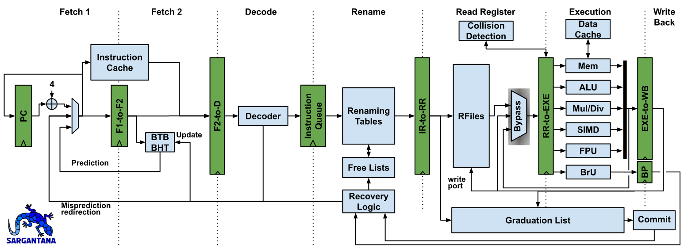

# Sargantana

  

Sargantana is a 64-bit processor based on RISC-V that implements the RV64G ISA.
Sargantana features a highly optimized 7-stage pipeline implementing out-of-order write-back, register renaming, and a non-blocking memory pipeline.
Sargantana achieves a 1.26 GHz frequency in the typical corner, and up to 1.69 GHz in the fast corner using 22nm FD-SOI commercial technology.

## Simulating and Emulating on an FPGA

To perform RTL simulations and/or emulating the design, please refer to the [Sargantana_tile](https://gitlab.bsc.es/hwdesign/rtl/core-tile/sargantana_tile) repo.

## Design

## Verification

Check this [wiki](https://gitlab.bsc.es/hwdesign/rtl/core-tile/sargantana_tile/-/wikis/How-to-run-the-different-tool-verification-in-Sargantana) in the Sargantana_tile repo.

### Set Up

**Verilator**

Install Verilator using your favourite package manager (or compile it yourself, you can find it in [github](https://github.com/verilator/verilator)). Make sure you have compatible versions of verilator and GCC as seen in the following table:

| Verilator | GCC    | Works? |
|-----------|--------|--------|
| 5.010     | 13.1.1 | YES    |
| 4.224     | 13.1.1 | YES    |
| 4.224     | 7.5.0  | YES    |
| 4.102     | 9.4.0  | YES    |

If you use a verilator and GCC version combination and is not in the table above, please update it. Specially if it doesn't work.

**RISC-V Compiler**

Install the RISC-V GCC crosscompiler toolchain using your favourite package manager. You can compile it yourself, at your own risk of course ;)

This table shows the RISC-V compiler versions that have been tested and are known to work:

| Version | Works? |
|---------|--------|
| 12.2.0  | YES    |
| 11.1.0  | YES    |
| 7.2.0   | NO     |

Again, if you have a different version, add it to the table, specially if you have trouble compiling the ISA tests.
